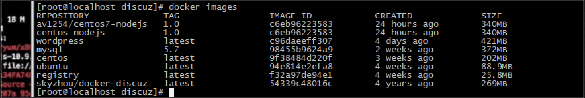

# Docker 构建镜像


## 一、构建自己的镜像


### 1.创建目录

```sh
		mkdir first; cd first
```
###  	

### 2.创建配置文件 dockerfile

```sh
vim dockerfile
```
```sh
FROM centos

# 镜像维护信息 xxx
MAINTAINER guang

# 指定工作目录
WORKDIR /app

# 将项目相关文件拷贝到app下,如果目录不存在会自动创建
COPY index.js /app
$COPY package.json /app

# 安装命令来自于 nodejs
RUN curl --silent --location https://rpm.nodesource.com/setup_10.x| bash - && yum -y install nodejs && npm install

# 暴露端口
EXPOSE 8080

# 容器启动命令
CMD ["node", "/app/index.js"]
```

```sh
vim index.js
```
```sh	
var http = require("http");

http.createServer(function(request, response) {  

  response.writeHead(200, {"Content-Type": "text/plain"});  

  response.write("Hello World");

  console.log(“hello”);

  response.end();

}).listen(8080);

console.log("nodejs start listen 8080 port!");
```

### 	

### 3. 构建镜像

```sh
docker build -t centos-nodejs:1.0
```

### 	

### 4. 查看镜像

```sh
docker images
```



### 	

### 5. 运行构建的镜像

```sh
docker run -p 8080:8080 -d centos-nodejs:1.0 .  # 最后有一个 点 表示当前目录是docker编译目录

docker ps 查看是否运行
```
###  	

### 6. 验证

```sh
curl http://127.0.0.1:8080/
```