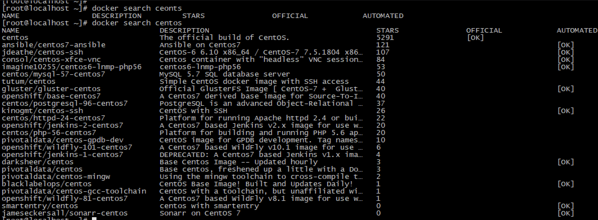
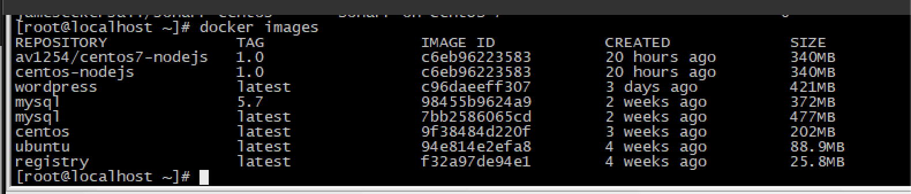

# Docker 命令及参数

### 1.查看镜像市场

```sh
docker search < image_name >
例子: 
docker search centos
```


### 2.从镜像市场拉取镜像

```sh
docker pull < image_name >
例子:
docker pull centos 
docker pull ubuntu
```



### 3.查看已有镜像

```sh
docker images
```



### 4.开启关闭容器

```sh
docker start xxx
docker stop xxx
```


### 5.查看正在运行的容器

```sh
docker ps
```


### 6.查看所有的容器

```sh
docker ps -a
```


### 7.动态查看容器日志

```sh
docker logs -f 容器ID
```


### 8.进入容器

```sh
docker attach 容器ID
docker exec -it xxxxxx bash
```

