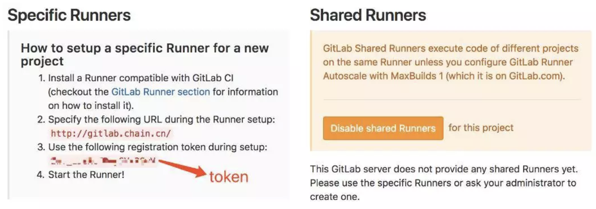
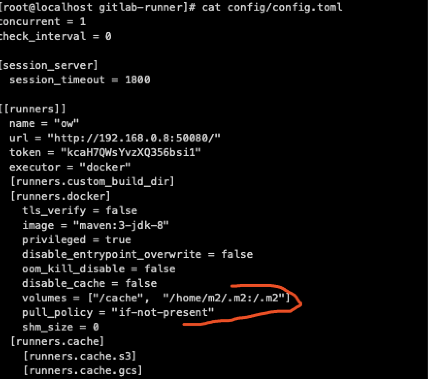

# Docker gitlab-runner 安装与注册


#### 一些技巧

```http
https://www.jianshu.com/p/3c0cbb6c2936
https://segmentfault.com/a/1190000020593208
```


## 1.  拉取镜像
```sh
docker pull gitlab/gitlab-runner
```


## 2. 运行
```sh
docker run -d --name gitlab-runner --restart always \
-v /home/docker/gitlab-runner/config:/etc/gitlab-runner \
-v /var/run/docker.sock:/var/run/docker.sock \
gitlab/gitlab-runner
```


## 3.注册
```sh
$ docker exec -it gitlab-runner gitlab-ci-multi-runner register

Please enter the gitlab-ci coordinator URL:
# gitlab的url, 如：http://gitlab.chain.cn
Please enter the gitlab-ci token for this runner:
# gitlab->你的项目->settings -> CI/CD ->Runners settings
Please enter the gitlab-ci description for this runner:
# 示例：demo
Please enter the gitlab-ci tags for this runner (comma separated):
# 示例：demo
Whether to run untagged builds [true/false]:
# true
Please enter the executor: docker, parallels, shell, kubernetes, docker-ssh, ssh, virtualbox, docker+machine, docker-ssh+machine:
# docker
Please enter the default Docker image (e.g. ruby:2.1):
# golang:1.9.4

```



## 4.修改runner配置文件 （这里一maven作为例子）

```sh
$ vim /srv/gitlab-runner/config/config.toml

volumes = ["/cache","/var/run/docker.sock:/var/run/docker.sock","/data/.m2/:/.m2/"]
pull_policy = "if-not-present"
```

##### ⚠️注意：需要重启该runner


修改完成后如下图



## 5.在gitlab项目根目录创建.gitlab-ci.yml文件

**填写runner规则，具体语法课参考官方文档：**[**https://docs.gitlab.com/ee/ci/yaml/**](https://link.jianshu.com/?t=https%3A%2F%2Fdocs.gitlab.com%2Fee%2Fci%2Fyaml%2F)

##### 以maven为例子

```sh
$ vim .gitlab-ci.yml
```
```yaml
image: maven:3-jdk-8

cache:
 key: ${CI_BUILD_STAGE}
 paths:
  - /.m2/

variables:
 MAVEN_CLI_OPTS: "-Dmaven.test.skip=true"
 MAVEN_OPTS: "-Dmaven.repo.local=/.m2/"

stages:
  - build
  - test
  - deploy

build_maven:
  stage: build
  script:
    - echo "build maven....."
    - mvn -Dmaven.repo.local=/.m2/ package -Dmaven.test.skip=true
  artifacts:
    expire_in: 1 days
    paths:
      - .

test_ow:
  stage: test
  script:
    - echo "run java test....."
    - java -jar ./sociallogic/target/sociallogic-1.0-SNAPSHOT.jar &
    - java -jar ./gamelogic/target/gamelogic-1.0-SNAPSHOT.jar

deploy_ow:
  stage: deploy
  script:
    - echo "deploy springboot...."
    - echo "run mvn install"
    - echo "done"

```
