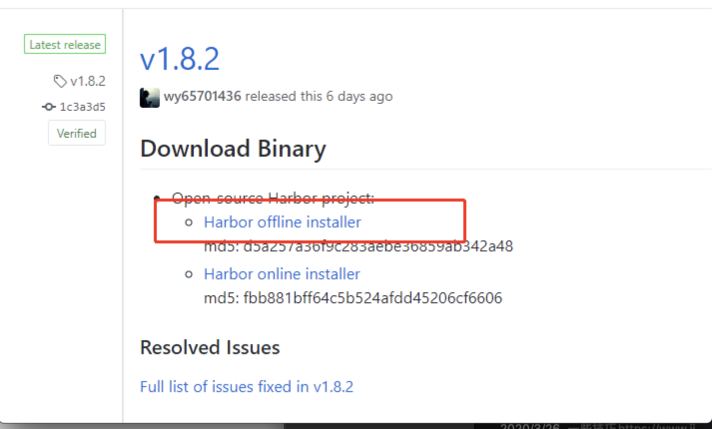
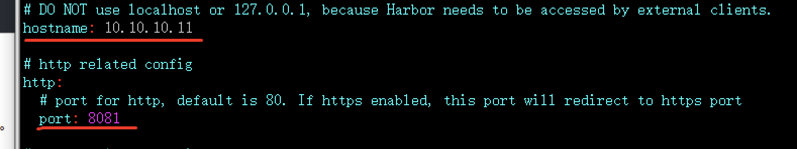
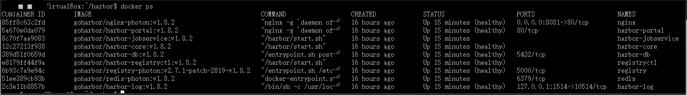
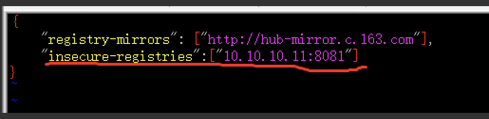
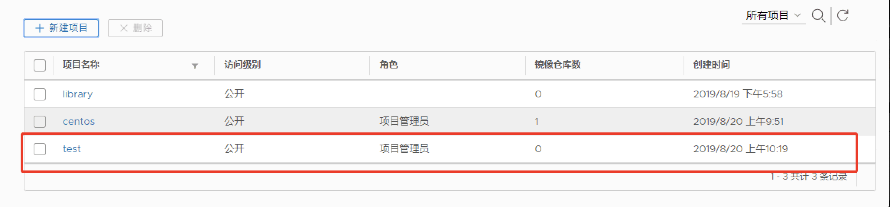
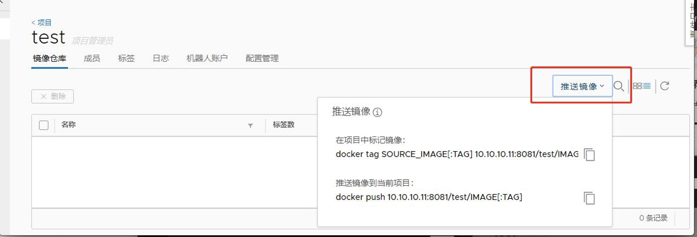
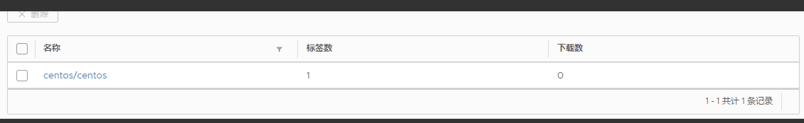

# 6.Docker 搭建私有仓库 Harbor


## 安装前提：需要docker-compose


下载安装包
```http
https://github.com/goharbor/harbor/releases

```



1. 解压
```sh
tar xf harbor-offline-installer-v1.8.2.tgz
cd harbor
```


2. 修改配置文件 harbor.yml



3. 安装
```sh
sudo ./prepare
sudo ./install.sh
```
###### 查看状态




4. 常用操作
```sh
docker-compose stop
docker-compose start
```


5. 修改docker配置支持私人仓库
```sh
sudo vim /etc/docker/daemon.json
```


 重启docker : service docker restart (出现harbor访问不了时，重启 docker-compose start)

 

6. 制作镜像

  1). 新建项目 （需要公开访问）


 2). 进入界面后点击 推送镜像获取命令



  3). 按照命令打包上传即可
```sh
docker tag SOURCE_IMAGE[:TAG] 10.10.10.11:8081/test/IMAGE[:TAG]
docker push 10.10.10.11:8081/test/IMAGE[:TAG]
```

